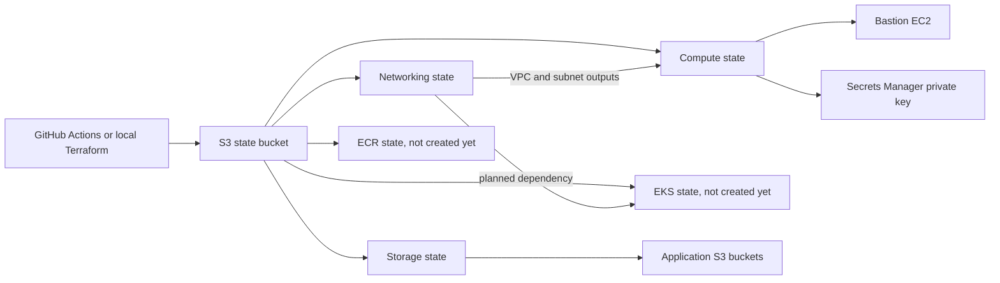

# Architecture overview

This repository describes infrastructure in one AWS account and one primary region, `ap-south-1`. Terraform is split into small root configurations so a change to a bucket does not require the same state file as a change to an EC2 instance. The `dev` prefix remains in existing state keys and resource names. It does not mean there is a second AWS account.

`bootstrap/` contains the state bucket root. `stacks/` contains independently runnable service roots. `modules/` contains reusable IAM building blocks called by a root. `docs/` explains how they fit together. The folder change did not change backend keys or Terraform resource addresses.

The old backup folder contains earlier examples and is not part of the active deployment.

## The pieces and how they connect

`bootstrap` manages the state bucket itself. Its five existing S3 resources were imported into Terraform state. That state lives at `bootstrap/terraform.tfstate` in the same bucket. Each component under `stacks/` has a separate state key. The bucket is versioned, encrypted with SSE-S3, and blocks public access.

| Root | Main responsibility | State key | Last verified deployment status |
| --- | --- | --- | --- |
| `bootstrap` | State bucket and its protection settings | `bootstrap/terraform.tfstate` | Imported and zero-change plan |
| `stacks/iam` | Optional IAM roles, policies, users, and attachments | Supplied at backend initialization | No resources configured by default |
| `stacks/networking` | VPC and public and private subnets | `dev/networking/terraform.tfstate` | Deployed |
| `stacks/compute` | EC2, security groups, IAM instance profile, SSH key secret | `dev/compute/terraform.tfstate` | Bastion deployed |
| `stacks/storage` | Application S3 buckets | `dev/storage/terraform.tfstate` | Deployed |
| `stacks/ecr` | Container image repositories | `dev/ecr/terraform.tfstate` | Code exists, no state object in the last inventory |
| `stacks/eks` | Kubernetes cluster, node groups, add-ons | `dev/eks/terraform.tfstate` | Code exists, not ready to deploy |

The five component roots share a backend bucket but have separate state objects. This keeps their changes and locks apart. Compute reads the networking root outputs through `terraform_remote_state`. EKS tries to do the same, but its output names do not yet match the networking outputs. Terraform can validate the EKS syntax without proving that a live EKS plan will work.

## How to read the Terraform code

Each root has a `backend.tf` for state location, `versions.tf` for Terraform and provider constraints, and `provider.tf` for AWS region selection. A `.terraform.lock.hcl` fixes provider versions when it is included in Git. `main.tf` declares resources or calls a community module. `variables.tf` defines input types, `terraform.tfvars` supplies values automatically, and `outputs.tf` exposes results to people or another root. Compute also has `locals.tf` to build EC2 user data.

An input variable changes a root's behavior. A `local` names a calculated value within a root. `for_each` creates resources from a map, using each map key as part of the Terraform address. This repository uses it for EC2 instances, S3 buckets, ECR repositories, EKS node groups, and add-ons. Keep an existing key such as `bastion` stable unless you plan a state move. A `count` appears in the EKS OIDC resources to turn that optional feature on or off. Changing a `for_each` key or a count index can affect state addresses even if the AWS object name looks similar.

The roots pin their community module versions where modules are used. Provider versions are selected by each root's lock file. The GitHub Actions callers also pin the shared workflow repository to a commit. These pins make a reviewable starting point for later changes. They do not make a Terraform apply safe by themselves. A plan against the correct account and state is still required.

## Deployment order and current limits

1. The state bucket must exist before a new component can use its S3 backend. It already exists and its bootstrap state has been adopted.
2. Networking comes before compute because compute reads its VPC and subnet outputs.
3. Storage is independent of compute. ECR can be planned separately once its configuration is reviewed.
4. EKS depends on networking, but its current output references need correction before a deployment plan. Private subnets have no NAT gateway. Phase 2 code makes NAT, an S3 gateway endpoint, and interface endpoints optional, but the current values leave all disabled. A future EKS design must check its node and add-on network paths.

The post-merge deployment handles deployed networking, storage, and compute in sequence, with a separate approval for each changed stack. Other roots being present in source code does not mean they are deployed. IAM Identity Center, RDS, Lambda, SNS, and the other services in the long-term goal do not yet have active roots here. See [pipeline.md](pipeline.md) for the triggers and [recovery.md](recovery.md) for failed-run recovery.

The key design rule is to preserve existing state keys and deployed resources while improving the code. The Phase 1 networking, compute, storage, and bootstrap plans were checked with zero proposed resource changes. The Phase 2 compute code gives each VM its own security group and optional IAM role, with `moved` blocks for existing resources. Direct SSH to the public bastion is still configured. The module's extra security group is removed so the per-VM rules control traffic. Check a fresh plan before any apply. Compute and storage have reported drift notices, which deserve review before a future change to those resources.

For details, read [backend.md](backend.md), [networking.md](networking.md), [compute.md](compute.md), and [storage.md](storage.md).
